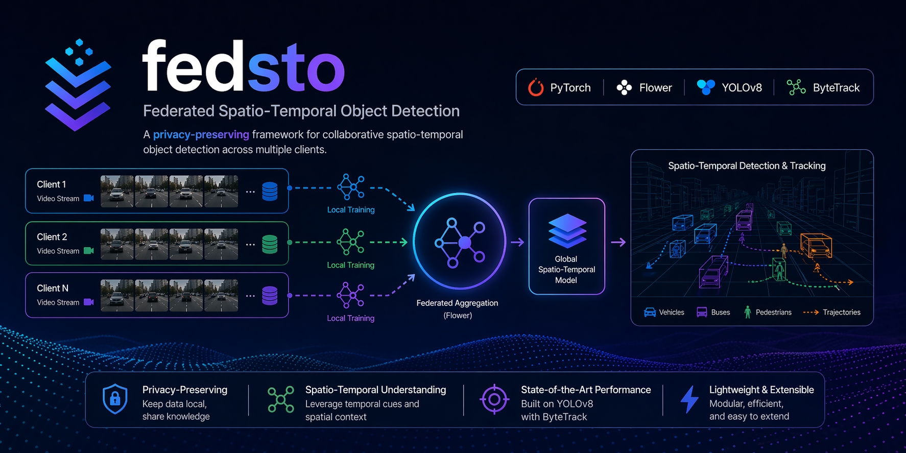

# Federated Detection POC



This repository is a research workspace for privacy-preserving object detection
with federated learning. It brings together a production-style FedSTO
reproduction route, a Dynamic Quality-Aware Class-wise Aggregation (DQA-CWA)
extension, notebook-driven experiment flows, and paper-style evaluation scripts
for weather-shifted BDD100K detection experiments.

## What Is In This Repository

The project currently has two main tracks:

| Path | Purpose |
| --- | --- |
| `navigating_data_heterogeneity/` | FedSTO-oriented reproduction workflow built around EfficientTeacher, BDD100K preparation, exact-reproduction notebooks, and paper-aligned evaluation helpers. |
| `dynamic_quality_aware_classwise_aggregation/` | DQA-CWA research workflow that reuses the FedSTO setup but changes the aggregation step, adds monitoring notebooks, and supports fast, exact, and same-day experiment tracks. |

## Main Workflows

### 1. FedSTO Exact Reproduction

If you want the baseline reproduction route, start here:

- Notebook: `navigating_data_heterogeneity/03_fedsto_exact_reproduction.ipynb`
- Runner: `navigating_data_heterogeneity/run_fedsto_efficientteacher_exact.py`
- Setup: `navigating_data_heterogeneity/setup_fedsto_exact_reproduction.py`
- Evaluation: `navigating_data_heterogeneity/evaluate_paper_protocol.py`

This route is the most faithful public-artifact reproduction path in the repo.
It vendors the data/setup metadata needed for the FedSTO experiments and adds
the runtime controls needed to survive long federated runs.

### 2. DQA-CWA Research Track

If you want the aggregation variant, use the DQA workspace:

- Overview: `dynamic_quality_aware_classwise_aggregation/README.md`
- Runner: `dynamic_quality_aware_classwise_aggregation/run_dqa_cwa_fedsto.py`
- Aggregation core: `dynamic_quality_aware_classwise_aggregation/dqa_cwa_aggregation.py`
- Evaluation: `dynamic_quality_aware_classwise_aggregation/evaluate_paper_protocol.py`

Notebook entry points:

- `dynamic_quality_aware_classwise_aggregation/01_dqa_cwa_reproduction.ipynb`
  - fast pilot path
- `dynamic_quality_aware_classwise_aggregation/02_dqa_cwa_exact_reproduction.ipynb`
  - paper-scale exact path
- `dynamic_quality_aware_classwise_aggregation/02_2_dqa_cwa_14h_reproduction.ipynb`
  - same-day path tuned to roughly 13-14 hours on a 2 GPU node

## Repository Structure

```text
.
├── dynamic_quality_aware_classwise_aggregation/
│   ├── 01_dqa_cwa_reproduction.ipynb
│   ├── 02_dqa_cwa_exact_reproduction.ipynb
│   ├── 02_2_dqa_cwa_14h_reproduction.ipynb
│   ├── README.md
│   ├── dqa_cwa_aggregation.py
│   ├── evaluate_paper_protocol.py
│   └── run_dqa_cwa_fedsto.py
├── navigating_data_heterogeneity/
│   ├── 00_download_and_inspect_bdd100k.ipynb
│   ├── 00_1_repair_and_materialize_bdd100k.ipynb
│   ├── 03_fedsto_exact_reproduction.ipynb
│   ├── FedSTO_paper_gap_audit.md
│   ├── evaluate_paper_protocol.py
│   ├── run_fedsto_efficientteacher_exact.py
│   └── setup_fedsto_exact_reproduction.py
└── assets/
    ├── DQA.png
    ├── fedSTO.png
    └── image.png
```

## What The Notebooks Give You

The notebook flows are designed to be practical, not just illustrative. They
handle the pieces that usually make long federated runs painful:

- launch and resume long multi-stage runs
- keep heavy training output out of the notebook itself
- surface progress, current round, and artifact locations
- evaluate final checkpoints with paper-style weather splits
- compare outputs across baseline and DQA variants

## Notebook Completion Notifications

Use `notebook_notify.py` when you want a final notebook cell to post a message
to Discord. It uses a Discord Incoming Webhook, so there is no bot process to
keep running. Discord's webhook API is documented here:
<https://docs.discord.com/developers/resources/webhook#execute-webhook>.

1. In Discord, open the target channel settings, create an Incoming Webhook, and
   copy its webhook URL.
2. Set the URL outside the notebook so it is not committed:

```bash
export DISCORD_WEBHOOK_URL="https://discord.com/api/webhooks/..."
```

If the notebook kernel was already running, restart it after exporting the
variable. As another local-only option, copy `.env.example` to `.env` and put
the webhook URL there; `.env` is ignored by git. You can also save it from a
notebook without showing the URL in outputs:

```python
from getpass import getpass
from notebook_notify import save_discord_webhook_url

save_discord_webhook_url(getpass("Discord webhook URL: "))
```

3. Add this as the last notebook cell:

```python
from notebook_notify import notify_discord

notify_discord(
    """
    DQA run finished.
    Check validation_reports/ for the final metrics.
    """,
    title="Experiment complete",
)
```

If the notebook kernel is started from a subdirectory and cannot import the
helper, add this before the import:

```python
from pathlib import Path
import sys

root = next(
    path for path in [Path.cwd(), *Path.cwd().parents]
    if (path / "notebook_notify.py").exists()
)
sys.path.insert(0, str(root))
```

Messages longer than Discord's 2000 character content limit are split across
multiple posts. Mentions are disabled by default to avoid accidental pings; pass
`allow_mentions=True` only when the message intentionally includes mentions.

## Typical Outputs

Generated artifacts live alongside the workflow that created them. In practice,
you will usually look in these places first:

- `navigating_data_heterogeneity/efficientteacher_fedsto/`
  - FedSTO checkpoints, manifests, logs, and validation reports
- `dynamic_quality_aware_classwise_aggregation/efficientteacher_dqa_cwa/`
  - default DQA pilot workspace
- `dynamic_quality_aware_classwise_aggregation/efficientteacher_dqa_cwa_exact/`
  - exact DQA workspace
- `dynamic_quality_aware_classwise_aggregation/efficientteacher_dqa_cwa_14h/`
  - same-day DQA workspace

Paper-style summaries are written under each workflow's `validation_reports/`
directory.

## Environment Expectations

This repository assumes a GPU-capable research environment. The current
workflows were built around:

- Python-based training and orchestration
- PyTorch distributed training
- EfficientTeacher-style object detection training
- BDD100K data preparation for server/client weather splits

The DQA notebooks are tuned around a 2 GPU setup for their published runtime
estimates. The exact path is much longer than the fast and same-day notebook
paths.

## Reading Order

If you are new to the repo, this is the smoothest path:

1. Read `navigating_data_heterogeneity/FedSTO_paper_gap_audit.md`
2. Open `dynamic_quality_aware_classwise_aggregation/README.md`
3. Use the notebook that matches the runtime budget you have available
4. Run paper-style evaluation once checkpoints are ready

## Notes

This is an active research repository rather than a polished library package.
That is intentional. The code is organized to support iteration, debugging,
restarts, and experiment comparison on long federated detection runs.
